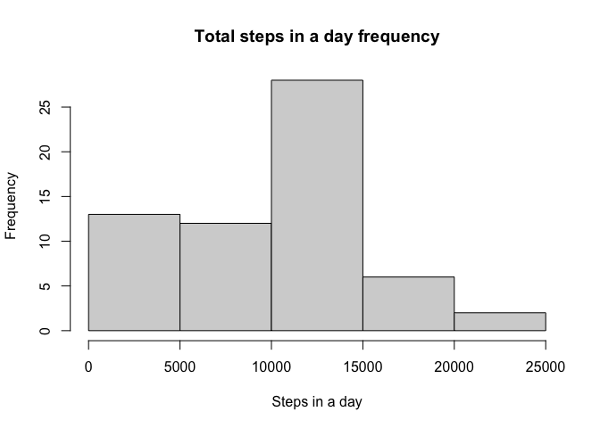
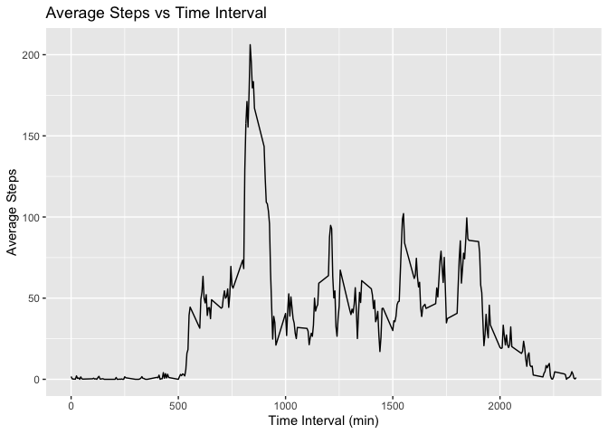
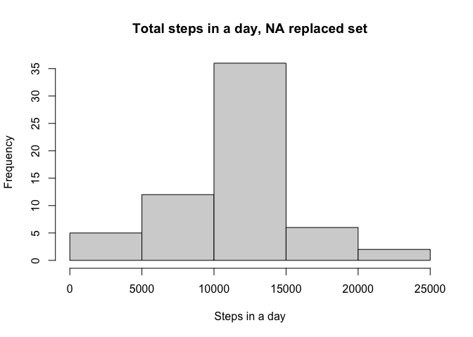
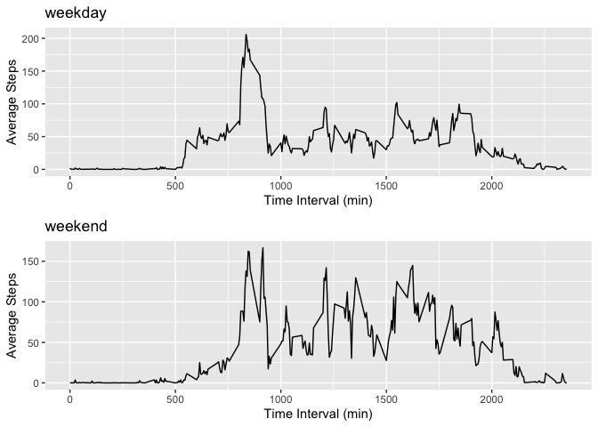

## Loading and preprocessing the data

```r
library(dplyr)
```

```
## 
## Attaching package: 'dplyr'
```

```
## The following objects are masked from 'package:stats':
## 
##     filter, lag
```

```
## The following objects are masked from 'package:base':
## 
##     intersect, setdiff, setequal, union
```

```r
activity<-read.csv("activity.csv")
```


## What is mean total number of steps taken per day?

```r
totalsteps<-tapply(activity$steps,activity$date,function(x) sum(x,na.rm=TRUE))
hist(totalsteps, main="Total steps in a day frequency", 
     xlab="Steps in a day")
```

<!-- -->

```r
meansteps<-mean(totalsteps)
medsteps<-median(totalsteps)
print(paste("The average daily total stepcount is: ", toString(meansteps),sep=" "))
```

```
## [1] "The average daily total stepcount is:  9354.22950819672"
```

```r
print(paste("The median daily total stepcount is: ", toString(medsteps),sep=" "))
```

```
## [1] "The median daily total stepcount is:  10395"
```

## What is the average daily activity pattern?

```r
library(ggplot2)

averageactivity<-tapply(activity$steps,activity$interval, function(x) mean(x,na.rm=TRUE))
averageactivity<-cbind(unique(activity$interval),averageactivity)
averageactivity<-as.data.frame(averageactivity)
names(averageactivity)<-c("interval", "average_steps")

p<-ggplot(data=averageactivity, aes(x=interval, y=average_steps)) + geom_line() + 
  labs(title = "Average Steps vs Time Interval",
       x="Time Interval (min)", y="Average Steps")
p
```

<!-- -->

```r
max_steps_interval<-averageactivity$interval[which.max(averageactivity$average_steps)]
print(paste("The interval with maximum steps is on average: ", toString(max_steps_interval),sep=" "))
```

```
## [1] "The interval with maximum steps is on average:  835"
```


## Imputing missing values
Using the average steps in an interval to fill in the NAs in the dataset

```r
NA_places <- is.na(activity$steps)
total_NAs <- sum(NA_places)
print(paste("The total NAs is",toString(total_NAs),sep=" "))
```

```
## [1] "The total NAs is 2304"
```

```r
## Find the interval that corresponds to the NAs
intervals <- activity$interval[NA_places]

## Find the indexes that correspond to the intervals
indexes <- which(intervals==as.integer(averageactivity$interval))

## Replace the NAs with the average interval steps
## have to initialize 2 different index variables because NA_places
## is the size of the activity but interval is size of only the NA values in
## activity

j = 0
for(i in 1:length(NA_places)){
  if(NA_places[i]==TRUE){
    j = j+1
    NA_places[i]<-averageactivity$average_steps[averageactivity$interval==intervals[j]]
  }else{
    NA_places[i]<-activity$steps[i]
  }
}


## make new dataframe with the replaced activity
replaced_activity<-cbind(NA_places,activity[2:3])
names(replaced_activity)<-c("steps","date","interval")

totalreplacedsteps<-tapply(replaced_activity$steps,replaced_activity$date,sum)
hist(totalreplacedsteps, main="Total steps in a day, NA replaced set",
     xlab="Steps in a day")
```

<!-- -->

```r
meanreplacedsteps<-mean(totalreplacedsteps)
medreplacedsteps<-median(totalreplacedsteps)
print(paste("The average daily total stepcount from new dataframe is: ", 
            toString(meanreplacedsteps),sep=" "))
```

```
## [1] "The average daily total stepcount from new dataframe is:  10766.1886792453"
```

```r
print(paste("The median daily total stepcount from new dataframe is: ", 
            toString(medreplacedsteps),sep=" "))
```

```
## [1] "The median daily total stepcount from new dataframe is:  10766.1886792453"
```


## Are there differences in activity patterns between weekdays and weekends?

```r
library(chron)
library(gridExtra)
```

```
## 
## Attaching package: 'gridExtra'
```

```
## The following object is masked from 'package:dplyr':
## 
##     combine
```

```r
## adding a column to dataframe for the weekdays
replaced_activity<-cbind(replaced_activity,weekdays(as.Date(replaced_activity$date)))
names(replaced_activity)<-c("steps","date","interval","day")

weekday_activity <- replaced_activity %>% filter(replaced_activity$day != "Saturday" | replaced_activity$day != "Sunday")
weekend_activity <- replaced_activity %>% filter(replaced_activity$day == "Saturday" | replaced_activity$day == "Sunday")

## weekday average activity across intervals
averagedayactivity<-tapply(weekday_activity$steps,weekday_activity$interval, function(x) mean(x,na.rm=TRUE))
averagedayactivity<-cbind(unique(activity$interval),averagedayactivity)
averagedayactivity<-as.data.frame(averagedayactivity)
names(averagedayactivity)<-c("interval", "average_steps")

## weekend average activity across intervals
averageendactivity<-tapply(weekend_activity$steps,weekend_activity$interval, function(x) mean(x,na.rm=TRUE))
averageendactivity<-cbind(unique(activity$interval),averageendactivity)
averageendactivity<-as.data.frame(averageendactivity)
names(averageendactivity)<-c("interval", "average_steps")


## 2 ggplots, 1 for weekday, 1 for weekend
p<-ggplot(data=averagedayactivity, aes(x=interval, y=average_steps)) + geom_line() + 
  labs(title = "weekday",
       x="Time Interval (min)", y="Average Steps")

q<-ggplot(data=averageendactivity, aes(x=interval, y=average_steps)) + geom_line() + 
  labs(title = "weekend",
       x="Time Interval (min)", y="Average Steps")

grid.arrange(p,q,ncol=1)
```

<!-- -->
